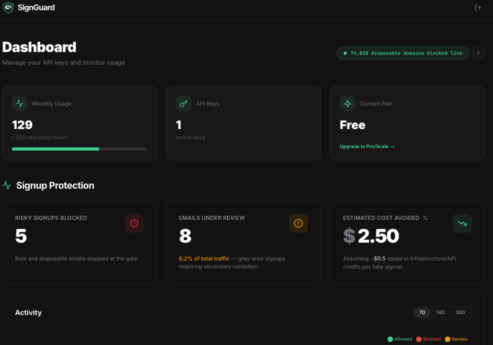
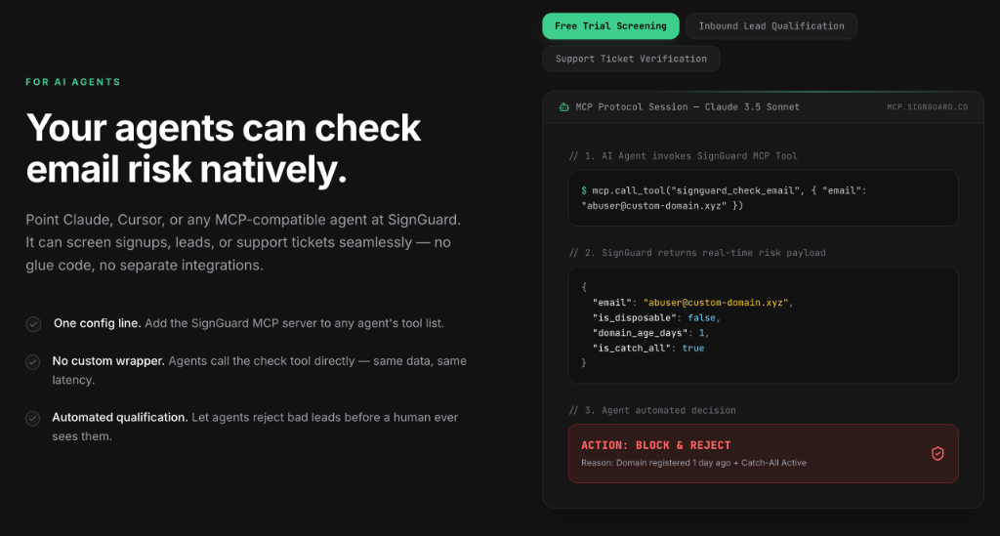
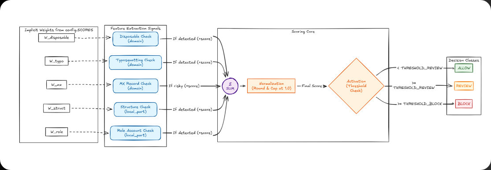

# Disposable Email Score

A robust, explainable risk-scoring engine for email signups. Detects disposable emails, typosquatting attacks, and suspicious domains.

[](https://www.python.org/downloads/)
[](LICENSE)
[](https://twitter.com/harshitpy)
[](https://join.slack.com/t/signguardworkspace/shared_invite/zt-448oj6uoy-ANp2rjwjQH3C0Th0rnUuVA)

**The open-source package gives you fast, local disposable-email detection; SignGuard Hosted adds deep network verification and daily intelligence updates without the maintenance overhead.**

## Features

- **Disposable Domain Detection** — Checks against 74,778 known disposable email domains
- **Typosquatting Detection** — Catches fake domains like `gmaiil.com`, `yahooo.com`
- **MX Risk Signals** — Detects suspicious or missing MX-related signals during local evaluation
- **Role Account Detection** — Flags shared inboxes like `admin@`, `info@`, `sales@`
- **Subdomain Detection** — Blocks `mail.tempmail.com` if `tempmail.com` is blocked
- **Plus Alias Detection** — Detects `user+tag@gmail.com` patterns
- **Allowlist Support** — Trusted domains bypass all checks
- **Explainable Output** — Returns score, decision, signals, and human-readable reasons

## 🚀 Two Ways to Run

This package is designed for flexibility. It provides fast, privacy-preserving local checks out of the box, and optional deep verification via the SignGuard Hosted API.

### 1. Local / Offline Mode (Default)
By default, the package runs entirely on your local machine using an embedded static list of 74,778 disposable domains.
- **Fast:** Fast local heuristic detection.
- **Private:** Email data is processed locally and does not leave your server.
- **Offline:** No network dependencies.
*(Note: Static lists are excellent for privacy and latency, but you must manually update this package to catch new domains since the static list is only updated in our repository releases).*

### OSS vs Hosted Comparison

| Capability | Local OSS | SignGuard Hosted |
|---|---:|---:|
| Disposable-domain detection | ✅ | ✅ |
| Typosquatting detection | ✅ | ✅ |
| Local/offline processing | ✅ | — |
| Very low local latency | ✅ | — |
| Automatic intelligence updates | — | ✅ Daily |
| DNS/MX verification | — | ✅ |
| SMTP mailbox verification | — | ✅ |
| Catch-all detection | — | ✅ |
| Domain-age/WHOIS signals | — | ✅ |
| Custom allow/block rules | — | ✅ |
| Dashboard & usage tracking | — | ✅ |
| Centralized API management | — | ✅ |
| MCP / AI Agent access | — | ✅ |

### Why upgrade from the open-source package?

This OSS package is intentionally designed to be highly useful on its own. **You do not have to pay SignGuard just to detect disposable domains.**

However, the SignGuard Hosted API is built for teams that need:
- **Daily managed intelligence updates** without application redeploys
- **DNS/MX verification**
- **Active SMTP verification** to assess mailbox-level deliverability and mail-server behavior
- **Catch-all detection**
- **Domain-age signals** to identify newly registered domains as an additional risk factor
- **Centralized allow/block rules** 
- **Dashboard and usage analytics**
- **API key management**
- **MCP / AI-agent integration**

**Core Philosophy:** You don't pay for the domain list. You pay for the managed infrastructure and deeper network verification around it.

---

### 2. SignGuard Hosted API
**[👉 Get your free SignGuard API Key here](https://signguard.co)**

When configured, the SDK automatically routes checks through our centralized API to leverage deeper verification logic.

- **Local fallback:** If the hosted API is unreachable due to network timeouts, connection errors, or server-side 5xx errors, the SDK instantly falls back to the local offline engine. *(Note: Invalid API keys (401) and rate limits (429) intentionally raise exceptions and do not fail open).*

#### See SignGuard in action

<p align="center">
  
  <br>
  <em>Manage SignGuard centrally — monitor usage, manage API keys, and configure security rules without changing application code.</em>
</p>

<p align="center">
  
  <br>
  <em>Let AI agents make decisions using SignGuard's hosted email-risk signals — including domain age and catch-all detection.</em>
</p>

### Setup API Key (Zero Code Changes)
Set the environment variable in your `.env` or shell. The library will automatically detect it and upgrade to hosted processing:
```bash
export SIGNGUARD_API_KEY="dsk_live_your_key_here"
```

### Run your check
The library will automatically resolve the environment variable and query the API:
```python
from disposable_email_score import evaluate_email

# Performs hosted validation if SIGNGUARD_API_KEY is set, otherwise local
result = evaluate_email("user@tempmail.xyz")
```

### Alternative: Pass API Key directly
```python
result = evaluate_email("user@tempmail.xyz", api_key="dsk_live_your_key_here")
```

### API Key Security & Lifecycle

- **Never expose your key to the frontend:** SignGuard API keys (`dsk_live_...`) are meant for backend/server-side use only.
- **Revocation:** Deleted keys from your dashboard are revoked instantly (`401 Unauthorized`).
- **Zero-Downtime Rotation:** Generate a new key, update your server, and then delete the old key.

### Privacy
- **Local Mode:** Email data is processed locally and does not leave your server.
- **Hosted Mode:** Email addresses are sent to the SignGuard API for processing and are processed in memory. Standard operational telemetry and error monitoring may process request data when required for reliability and debugging.

### HTTP Errors & Rate Limits

If calling the API directly (without this SDK):
- `401 Unauthorized`: Invalid or revoked API key.
- `402 Payment Required`: Monthly quota exhausted.
- `429 Too Many Requests`: Concurrency limit exceeded.

## Installation

```bash
pip install disposable-email-score
```

## Quick Start

```python
from disposable_email_score import evaluate_email

result = evaluate_email("user@tempmail.xyz")
print(result.model_dump_json(indent=2))
```

### Output

```json
{
  "decision": "block",
  "score": 0.7,
  "thresholds": {
    "allow": 0.3,
    "block": 0.7
  },
  "signals": {
    "domain_in_blocklist": 0.7
  },
  "reasons": [
    "known_disposable_domain"
  ]
}
```

### Using RiskLevel

```python
from disposable_email_score import evaluate_email, RiskLevel

result = evaluate_email("test@example.com")

if result.decision == RiskLevel.BLOCK:
    print("❌ Blocked!")
elif result.decision == RiskLevel.REVIEW:
    print("🟡 Needs review")
else:
    print("✅ Allowed")
```

## Benchmark Metrics

Performance varies significantly depending on whether you are using the local engine or the Hosted API. 

### Local / Fast Path
- **Latency:** ~0.3ms average in a 1,000-request local benchmark

### Hosted / Deep Verification
*(Note: Network-dependent; latency varies based on DNS/SMTP verification and network conditions. The following metrics are indicative of a 100-request load test performed against the live SignGuard API from a standard cloud region.)*
| Percentile | Response Time |
|------------|---------------|
| P50 | 6 ms |
| P75 | 15 ms |
| P90 | 380 ms |
| P95 | 780 ms |
| P99 | 820 ms |

## How It Works



## Risk Levels

| Score | Decision | Action |
|-------|----------|--------|
| < 0.3 | `allow` | Low risk — let them through |
| 0.3 - 0.69 | `review` | Medium risk — require CAPTCHA or verification |
| ≥ 0.7 | `block` | High risk — reject signup |

## Signals & Weights

| Signal | Weight | Description |
|--------|--------|-------------|
| `domain_in_blocklist` | 0.7 | Known disposable domain |
| `typosquatting` | 0.6 | Looks like a typo of gmail.com, yahoo.com, etc. |
| `mx_risky_or_missing` | 0.5 | No MX records or suspicious mail infrastructure |
| `plus_alias` | 0.05 | Uses `+tag` in local part |

## Framework Integration

### FastAPI

```python
from fastapi import FastAPI
from disposable_email_score import evaluate_email, RiskResult

app = FastAPI()

@app.get("/check-email", response_model=RiskResult)
def check_email(email: str):
    return evaluate_email(email)
```

### Django

```python
from django.http import JsonResponse
from disposable_email_score import evaluate_email

def validate_signup(request):
    email = request.GET.get('email')
    result = evaluate_email(email)
    
    if result.decision == "block":
        return JsonResponse({'error': 'Email not allowed'}, status=400)
    
    return JsonResponse(result.model_dump())
```

## Configuration

All weights and thresholds are in `config.py`:

```python
THRESHOLD_BLOCK = 0.7
THRESHOLD_REVIEW = 0.3

SCORES = {
    "disposable_domain": 0.7,
    "typosquatting": 0.6,
    "no_mx_records": 0.5,
    ...
}
```

## Auto-Updates

The internal static domain list is automatically updated **monthly** via GitHub Actions fetching from our private upstream threat intelligence feed (`BLOCKLIST_URL`). When new domains are detected, a new version of the package is released. **You must upgrade/reinstall the Python package to receive these updated lists.**

## Development

```bash
# Install with dev dependencies
pip install -e ".[dev]"

# Run tests
pytest

# Format code
ruff format src/ tests/

# Lint
ruff check src/ tests/
```

## License

MIT
